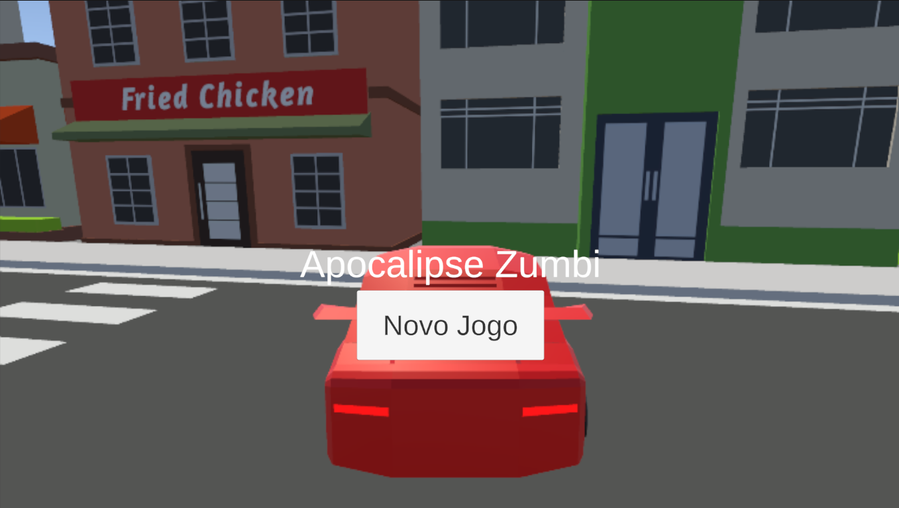
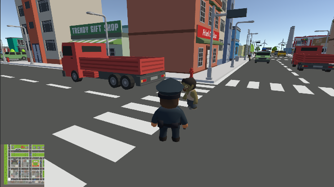
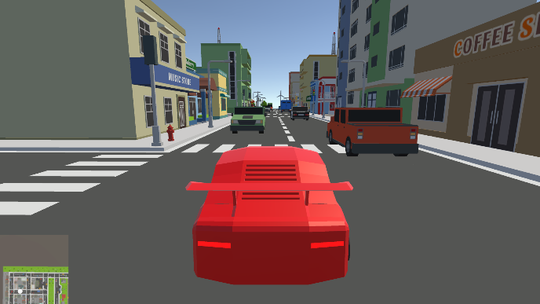
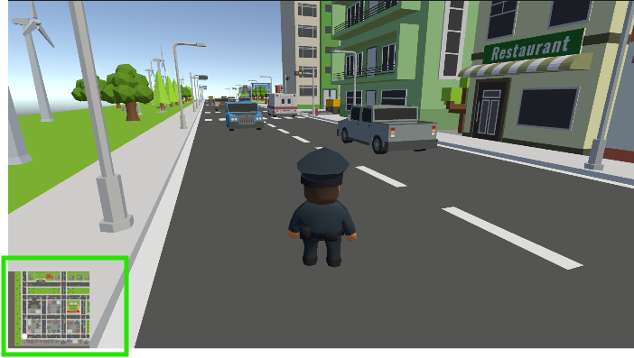
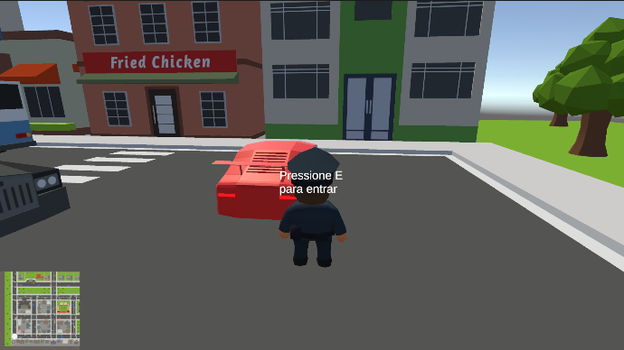

# 🧟 Apocalipse Zumbi

  ## Descrição

  **Apocalipse Zumbi** é um jogo de ação desenvolvido em Unity no qual o jogador controla um policial solitário em meio ao caos de uma cidade tomada por
  mortos-vivos. O objetivo é sobreviver ao apocalipse, eliminando zumbis espalhados pelas ruas usando armas encontradas ao longo do mapa. Com liberdade para
  explorar a cidade a pé ou de carro, o jogador precisa de estratégia e reflexos rápidos para se manter vivo enquanto limpa as ruas do perigo.

  ---

  ## 🎮 Instruções de Jogabilidade

  ### Movimentação
  | Tecla | Ação |
  |-------|------|
  | `W` `A` `S` `D` | Mover o personagem |
  | `Espaço` | Atacar / Bater no zumbi |

  ### Armas
  - Procure as armas escondidas pela cidade
  - Passe por cima delas para coletá-las automaticamente
  - Use as armas para eliminar os zumbis com mais eficiência

  ### Carro
  | Tecla | Ação |
  |-------|------|
  | `E` (perto do carro vermelho) | Entrar / Sair do carro |
  | `W` `A` `S` `D` | Dirigir o carro |
  | `Espaço` | Ligar/desligar o farol |

  ### Mini-mapa
  - Fique de olho no **mini-mapa** no canto **inferior esquerdo** da tela para se localizar na cidade

  ---

  ## 🎬 Gameplay

  [](https://www.youtube.com/watch?v=YcCSjRE3kJw)

  > Clique na imagem acima para assistir à gameplay completa no YouTube.

  ---

  ## 📸 Screenshots

  ### Menu Principal
  <!-- Arraste sua imagem aqui no editor do GitHub -->
  

  ### Gameplay - Combate com Zumbis
  <!-- Arraste sua imagem aqui no editor do GitHub -->
  

  ### Gameplay - Dirigindo pela Cidade
  <!-- Arraste sua imagem aqui no editor do GitHub -->
  

  ---

  ## ⚙️ Funcionalidades Desenvolvidas

  ### 1. Mini-mapa com rastreamento do jogador

  Foi desenvolvido um sistema de mini-mapa que exibe a posição e a rotação do jogador em tempo real no canto inferior esquerdo da tela. A seta no mini-mapa acompanha tanto o
  deslocamento quanto a direção para onde o jogador está olhando, permitindo navegação precisa pela cidade sem precisar pausar o jogo.

  ```csharp
  using UnityEngine;
  using UnityEngine.UI;

  public class SetaMiniMapa : MonoBehaviour
  {
      public Transform jogador;
      public float escala = 0.5f;

      private RectTransform retTransform;

      void Start()
      {
          retTransform = GetComponent<RectTransform>();
      }

      void Update()
      {
          retTransform.anchoredPosition = new Vector2(
              jogador.position.x * escala,
              jogador.position.z * escala
          );

          retTransform.localEulerAngles = new Vector3(
              0, 0, -jogador.eulerAngles.y
          );
      }
  }
  ```

  

  ---

  ### 2. Sistema de entrar e sair do carro

  Foi desenvolvido um sistema de interação com veículos que detecta a proximidade do jogador ao carro vermelho e exibe um aviso na tela para entrar. Ao pressionar `E`, o personagem
  é desativado, a câmera muda para a visão do veículo e o controle do carro é habilitado. Ao pressionar `E` novamente, o jogador reaparece ao lado do carro e retoma o controle
  normal do personagem.

  ```csharp
  using System.Collections;
  using System.Collections.Generic;
  using UnityEngine;
  using UnityEngine.UI;

  public class EntrarCarro : MonoBehaviour
  {
      [Header("Referências")]
      public GameObject personagem;
      public Camera cameraCarro;
      public Camera cameraPersonagem;
      public GameObject textEntrarCarro;

      [Header("Configurações")]
      public float distanciaEntrar = 5f;

      private bool dentroDoRaio = false;
      private bool dentroDoCarro = false;
      private Carro scriptCarro;

      void Start()
      {
          scriptCarro = GetComponent<Carro>();
      }

      void Update()
      {
          if (personagem == null) return;

          float dist = Vector3.Distance(transform.position, personagem.transform.position);

          if (dist <= distanciaEntrar && !dentroDoCarro)
          {
              dentroDoRaio = true;
              if (textEntrarCarro != null)
                  textEntrarCarro.SetActive(true);
          }
          else if (!dentroDoCarro)
          {
              dentroDoRaio = false;
              if (textEntrarCarro != null)
                  textEntrarCarro.SetActive(false);
          }

          if (Input.GetKeyDown(KeyCode.E))
          {
              if (dentroDoRaio && !dentroDoCarro)
                  EntrarNoCarro();
              else if (dentroDoCarro)
                  SairDoCarro();
          }
      }

      void EntrarNoCarro()
      {
          dentroDoCarro = true;
          dentroDoRaio = false;
          personagem.SetActive(false);
          if (cameraPersonagem != null) cameraPersonagem.gameObject.SetActive(false);
          if (cameraCarro != null) cameraCarro.gameObject.SetActive(true);
          if (scriptCarro != null) scriptCarro.enabled = true;
          if (textEntrarCarro != null) textEntrarCarro.SetActive(false);
      }

      void SairDoCarro()
      {
          dentroDoCarro = false;
          personagem.SetActive(true);
          personagem.transform.position = transform.position + transform.right * 3f;
          if (cameraCarro != null) cameraCarro.gameObject.SetActive(false);
          if (cameraPersonagem != null) cameraPersonagem.gameObject.SetActive(true);
          if (scriptCarro != null) scriptCarro.enabled = false;
      }
  }
  ```

  

  ---

  ## 🛠️ Tecnologias Utilizadas

  - Unity
  - C#
  - Unity Input System
  - TextMesh Pro

  ---

  ## 👩‍💻 Desenvolvedora

  **Julia Lopes Coimbra**
